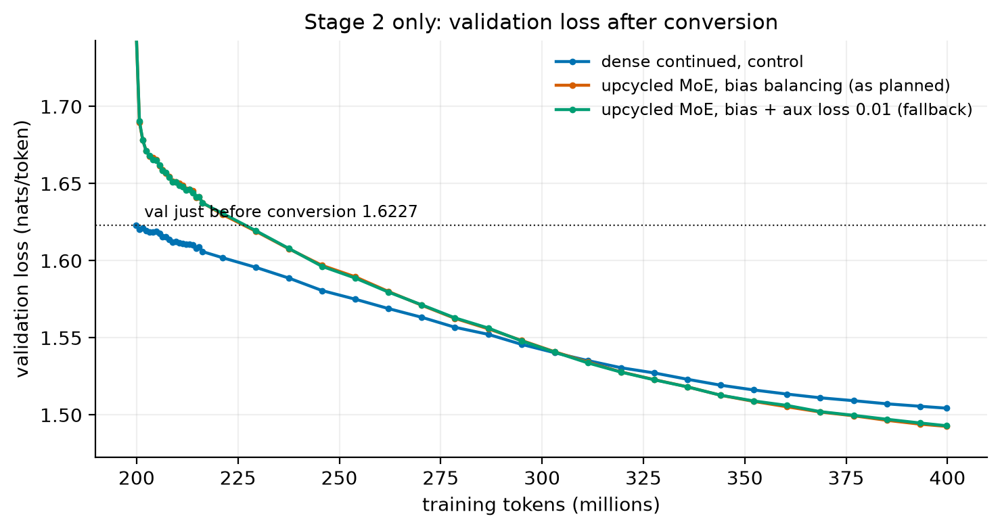
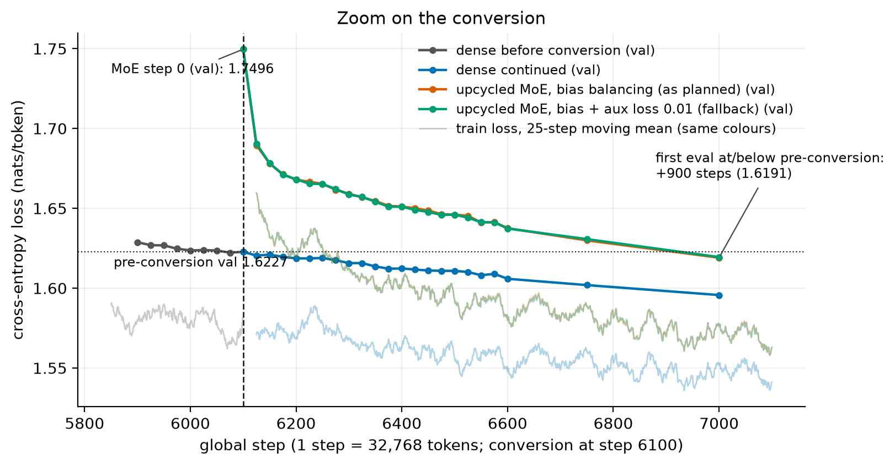
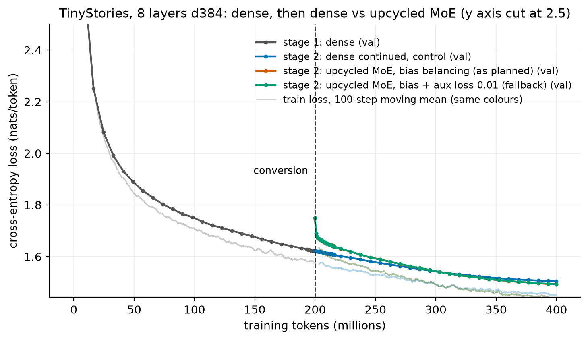
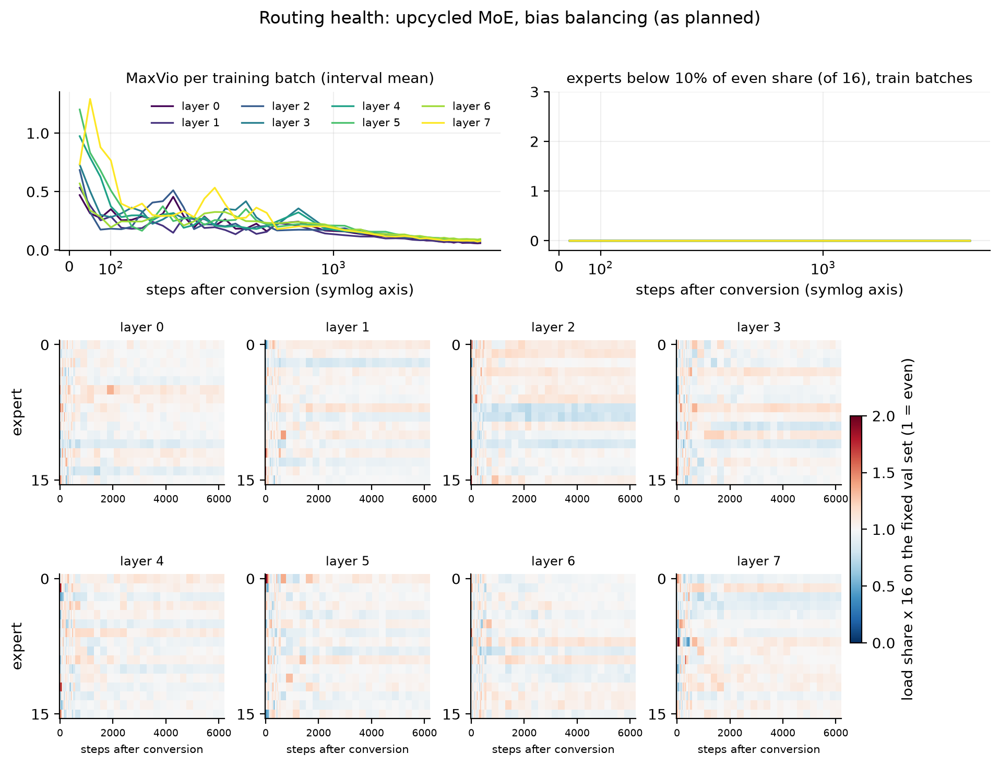

# Dense to MoE: upcycling a 17M-parameter TinyStories model

Built as ERA V5 Session 14 assignment. The task: train a standard dense ("linear") model, convert it into a mixture-of-experts model, and show that it continues to train and reduce loss.

I trained a standard dense transformer (17.3M parameters) on 200M TinyStories tokens. Then I cut every feed-forward block into one shared expert plus 16 routed experts (top-2) and kept training for another 200M tokens. A dense control continued from the same checkpoint on exactly the same batches. The MoE took a loss jump at the conversion, got back below its pre-conversion validation loss after 900 steps, and kept going down for the rest of the run. It finished 0.130 below its pre-conversion loss and 0.012 below the dense control. Training logs for every run are in [`logs/`](logs/).

| validation loss on the fixed 524,288-token set | step | tokens seen | val loss |
|---|---:|---:|---:|
| dense, just before conversion | 6,100 | 199.9M | **1.6227** |
| MoE immediately after conversion (step 0, no training) | 6,100 | 199.9M | **1.7496** |
| MoE, first eval at or below the pre-conversion value | 7,000 | 229.4M | **1.6191** |
| MoE, end of stage 2 | 12,200 | 399.8M | **1.4925** |
| dense control, end of stage 2 | 12,200 | 399.8M | **1.5043** |

All numbers come from [`results/headline.json`](results/headline.json), which [`src/analyze.py`](src/analyze.py) computes from the JSONL logs.



## The experiment

```
dense, 0 -> 199.9M tokens (6,100 steps) --+--> upcycled MoE, 199.9M more tokens     (bias balancing, as planned)
                                          +--> upcycled MoE, 199.9M more tokens     (bias + aux loss, pre-planned fallback)
                                          +--> dense continued, 199.9M more tokens  (control)
```

All three stage-2 arms start from the same saved checkpoint (`stage1_final.pt`, step 6,100). They use the same LR schedule, the same batches in the same order and the same validation tokens. "Linear model" in the task means the standard dense transformer. The conversion keeps attention and replaces each feed-forward block with a router plus experts.

### Data

- `roneneldan/TinyStories`, Hugging Face default config. Train split: 2,119,719 rows, of which 2,119,489 are non-empty. Validation split: 21,990 stories.
- Tokenizer: byte-level BPE, vocabulary 8,192, trained on the full train split with `<|endoftext|>` = id 0 ([`results/tokenizer.json`](results/tokenizer.json)). A small vocabulary keeps the embedding at 3.1M of the 17.3M parameters.
- The train split tokenizes to 466,735,154 tokens (about 220 per story), with each story followed by `<|endoftext|>`. The run uses 399,769,600 of them: 12,200 steps x 128 sequences x 256 tokens, cut into 256-token windows. The window order is one fixed random permutation (seed 1337), and global step *s* always reads windows `perm[128s : 128s+128]`. No window is read twice. Both stage-2 arms therefore see identical batches, and a resumed job sees the same data it would have seen.
- Fixed validation set: the first 2,048 x 256 + 1 tokens of the tokenized validation split. That is 524,288 predicted tokens, and every eval of every arm uses the same tokens.
- Hashes are in [`results/data_meta.json`](results/data_meta.json) (sha256 of `tokenizer.json`, `train.bin`, `val_fixed.bin`).

### Model ([`src/model.py`](src/model.py))

- Decoder-only, pre-norm, 8 layers, d_model 384, 6 heads of 64, context 256, RoPE, RMSNorm, no biases anywhere, tied input/output embedding.
- FFN: SwiGLU `down(silu(gate x) * up x)` with hidden width H = 1024. Bias-free matters, because the FFN output is then an exact sum of 1,024 per-neuron terms, so cutting it into neuron subsets is well defined.
- Init: normal(0, 0.02), with output projections (attention `proj`, FFN `down`) at 0.02 / sqrt(16).

### Training ([`src/train.py`](src/train.py))

- AdamW (fused), betas (0.9, 0.95), eps 1e-8, weight decay 0.1 on matrices (including embedding and routers), 0 on norm weights. Gradient clipping at 1.0. bf16 autocast with fp32 weights.
- One LR schedule over the whole 12,200-step run: 200-step linear warmup to 1e-3, then cosine to 1e-4. At the conversion step the LR is 5.62e-4, and every arm gets the same LR at every step.
- Peak LR 1e-3 came from a 600-step smoke test of 6e-4, 1e-3 and 2e-3 ([`logs/lr_smoke/`](logs/lr_smoke/)). The val losses at step 600 were 2.2395, 2.1658 and 2.1438. 2e-3 was ahead, but its lead over 1e-3 shrank from 0.106 at step 250 to 0.022 at step 600, and short runs favour high LRs. After warmup, 2e-3 also had a gradient-norm spike to 6.6 (step 270), while 1e-3 never went above 0.81. I took 1e-3 as the safer choice for a run that has to survive a conversion halfway through.
- Evals on the fixed set every 250 steps, and every 25 steps from 200 steps before the conversion to 500 steps after it. Train loss, LR and gradient norm are logged every step. Throughput and peak memory are logged every 50 steps.

### The conversion ([`src/model.py`](src/model.py), `upcycle`)

For every layer (seed 2026, per-layer generator):

1. Randomly split the 1,024 FFN neurons into halves A and B (512 each).
2. **Shared expert** (always on, weight 1): neurons A, i.e. the matching rows of `gate`/`up` and columns of `down`, copied exactly.
3. **16 routed experts**, 256 neurons each: 8 random complementary pairs of B. Every B neuron is in exactly 8 experts, no neuron is lost, and the experts differ from each other from step 0.
4. **Router**: new 384 -> 16 linear map per layer, init std 0.02, always computed in fp32 (autocast off).
5. **Routing**: top-2 of 16. The weights are a softmax over the two selected logits, so they sum to 1. Layer output = `shared(x) + 2.0 * (w1 * e1(x) + w2 * e2(x))`. The fixed 2.0 is the routed scaling factor. Each routed expert holds half of B, so the weighted pair carries about half of B's contribution, and the 2.0 restores it. If a token picks a complementary pair with equal weights, the layer reproduces the dense FFN exactly.
6. **Balancing**: loss-free bias (Wang et al. 2024). A per-expert bias is added to the logits for choosing only (not for the weights). After every step it moves by `0.001 * sign(mean_load - load_i)`, with load counted over the whole 32,768-token batch. No capacity limit, no dropped tokens.
7. **Sparse execution**: tokens are sorted by expert and each expert runs only on its own tokens. No expert is computed and then masked.

Embeddings, all attention weights and all norms are carried over bit-identically, and every expert weight is an exact index subset of the trained dense FFN. The only new parameters are the 8 routers (49,152 parameters), plus 128 non-trained bias values.

**Optimizer state at the seam.** AdamW state (both moments and step count) is carried over for every unchanged tensor. For the shared and routed experts I sliced the dense FFN's `exp_avg` and `exp_avg_sq` by the same neuron indices. Routers start with fresh state. There is no LR ramp at the seam, and the dense control gets no intervention. A side effect of slicing: a routed expert only gets gradient from the tokens routed to it, about 1/8 of them. Its gradient is therefore smaller than the dense neuron's was, and the inherited second moment damps its first updates until `exp_avg_sq` adapts (beta2 = 0.95, about 20 steps).

**Parameter accounting** (printed from the real modules in [`results/checks_stage1_checkpoint.txt`](results/checks_stage1_checkpoint.txt)):

| | dense | MoE |
|---|---:|---:|
| embedding (tied head) | 3,145,728 | 3,145,728 |
| attention | 4,718,592 | 4,718,592 |
| norms | 6,528 | 6,528 |
| FFN / shared experts | 9,437,184 | 4,718,592 |
| routed experts | | 37,748,736 |
| routers | | 49,152 |
| **total** | **17,308,032** | **50,387,328** (2.91x) |
| **active per token** | 17,308,032 | **17,357,184** (1.003x) |
| FFN width per layer, total / active | 1,024 / 1,024 | 4,608 / 1,024 |

Total parameters (and so memory and optimizer state) grow 2.9x, while the active FFN width per token stays at 1,024, the same as the dense model.

**Why this design.** It is the "partition" upcycling method with a shared expert. That is the family Lightning LM used for its dense to first-MoE step (dense FFN as shared expert, 20 routed experts from random overlapping halves, top-2; arXiv 2606.07404), which in turn descends from Qwen1.5-MoE and Sparse Upcycling. I changed one thing on purpose. The paper (and my course notes) say Lightning's shared expert was the *full* dense FFN, with the routed halves added on top. That doubles the active FFN width and duplicates every neuron. The lecture that accompanied the notes instead described taking half of the dense width as the shared expert. I used that half-width version: the dense width is split between the shared expert and the routed experts, so active compute matches the dense model, and the comparison with the dense control is not confounded by extra compute per token. Plain copy upcycling was rejected because all experts start identical (the clone problem) and top-2 copies double the active compute. Drop-upcycling was rejected because redrawing half the neurons throws away trained weights when partitioning already gives different experts.

## Checks run before the long training

[`src/checks.py`](src/checks.py) was run on a random-init model at the real config before any training ([`results/checks_random_init.txt`](results/checks_random_init.txt)). It was run again on the real stage-1 checkpoint before stage 2 started ([`results/checks_stage1_checkpoint.txt`](results/checks_stage1_checkpoint.txt)). All checks pass on both:

1. The shared expert equals the dense FFN restricted to A, and each routed expert equals the dense FFN restricted to its neurons. The max abs difference is 0 in float64. For every complementary pair p, `shared + e_2p + e_2p+1 == dense FFN` to 1.4e-14. End to end: with the router zeroed and the bias forcing pair p on every token, the full MoE model's logits match the dense model's to within 3e-14 on the trained checkpoint (4e-15 at random init), for all 8 pairs.
2. Coverage: |A| = 512, union of all sets = 1,024, no A neuron in a routed expert, and every B neuron in exactly 8 experts. All 16 experts are distinct and the pairs are complementary, in all 8 layers.
3. All 34 carried tensors (embedding, attention, norms) are bit-identical (`torch.equal`).
4. Parameter accounting as in the table above.
5. Exactly 2 expert evaluations per token (counted inside the dispatch), the two selected experts are distinct, the weights sum to 1 (to 2.2e-16), and the sparse dispatch equals a masked all-experts reference.
6. Optimizer-state transfer: the carried and sliced moments equal the dense moments at the right indices, and only the 8 routers have fresh state.

**Step-0 validation loss with no training** (logged by the MoE job at the conversion, [`logs/stage2_moe.jsonl`](logs/stage2_moe.jsonl), event `step0_val`):

| model on the fixed validation set | val loss |
|---|---:|
| dense checkpoint (step 6,100) | 1.6227 |
| upcycled MoE | 1.7496 |
| same MoE, routed experts re-initialised randomly (shared expert, router, attention etc. inherited) | 3.9132 |
| same MoE, shared and routed experts all random | 11.0076 |
| fully random MoE | 9.0695 |
| uniform over 8,192 tokens, ln(8192) | 9.0109 |

The upcycled MoE starts 0.127 above the dense checkpoint, while random routed experts cost 2.29. The inherited expert weights are clearly doing the work, and the jump is the price of the routed half being only an approximation. With all FFN weights random the loss is worse than uniform: trained attention feeding random FFNs produces confident wrong logits.

## What happened

### Stage 1 and the gate

The dense model went from 9.03 (step 0) to 1.6227 at step 6,100 ([`logs/stage1_dense.jsonl`](logs/stage1_dense.jsonl)). It was still improving when I converted: the 250-step evals were 1.6580, 1.6489, 1.6411, 1.6331 and 1.6236 for steps 5,000 to 6,000. At 25-step resolution, the last few evals move by less than 0.001 and are not strictly monotonic (6,075: 1.6222, 6,100: 1.6227). A sample from the checkpoint is ordinary TinyStories text:

> Once upon a time, there was a little girl named Lily. She loved to go fishing with her dad. One day, they went fishing in the desert. Lily's dad put a cast on her hook and cast it in the water. Lily was so happy to see the cast. But then, the cast was too hot and she lost her balance. She fell into the water and got very wet. ...

### At the conversion and after



- Just before conversion: 1.6227. MoE step 0: 1.7496 (+0.127).
- The first 25 steps took back half of the jump (1.6895 at step 6,125). After that it was a slower climb back: 1.6591 at +200 steps and 1.6375 at +500.
- The MoE got back below the pre-conversion value at step 7,000 (+900 steps, 29.5M tokens, about 15% of stage 2) with 1.6191. The dense control was at 1.5957 at that step.
- It then kept falling to 1.4925 at step 12,200. That is 0.130 below the pre-conversion value. After the conversion step there is one small uptick between consecutive evals (+0.0002 at step 6,575); otherwise every eval is lower than the previous one.



### Against the dense control

| steps after conversion | 0 | 100 | 500 | 900 | 1,900 | 2,900 | 3,900 | 4,900 | 5,900 | 6,100 |
|---|---:|---:|---:|---:|---:|---:|---:|---:|---:|---:|
| MoE minus dense (val) | +0.127 | +0.049 | +0.032 | +0.023 | +0.011 | +0.003 | -0.004 | -0.008 | -0.012 | **-0.012** |

The MoE trailed the dense control for the first 3,400 steps. It first beat it at step 9,500 (111M tokens after conversion) and stayed below it from there on, ending at 1.4925 vs 1.5043. I did not tune anything toward this. The MoE has 2.9x the parameters at the same active compute, so being slightly ahead after 200M tokens is not surprising. One seed and one data order cannot tell how robust a 0.012 gap is.

### Routing health



In the main run, bias balancing alone kept the experts healthy:

- **MaxVio on the val set at step 0:** 0.44 to 1.51 per layer. The fresh router is unbalanced.
- **Per-batch MaxVio** fell below 0.5 within about 125 steps and stayed at or below 0.21 in every layer after +500 steps. At the end it was 0.06 to 0.10 per layer.
- **Final val-set MaxVio:** 0.07 to 0.16. Every expert ends between 0.82x and 1.16x of the even share.
- **Dead experts:** no expert ever fell below 10% of the even share (my "dead" threshold), and none ever got zero tokens, on any training interval or val eval, in any layer.
- **Routing confidence:** routing entropy over all 16 logits ends at 2.47 to 2.67 nats (max ln 16 = 2.77). The mean top-1 weight within the chosen pair ends at 0.58 to 0.62. So the router is fairly soft. Later layers are a bit more decided than early ones.

**The smoke test did show collapse, which is why there is a second MoE arm.** Before the real run I converted the 600-step LR-smoke checkpoint and trained it for 1,400 steps ([`logs/smoke_stage2/`](logs/smoke_stage2/)). The loss side looked fine there: the jump was 0.056, recovery took 50 steps, and the MoE was 0.010 ahead of the dense control after 1,400 steps. Routing did not hold:

- Layer 2's MaxVio climbed to 4.45.
- By step 2,000, layer 2 had 3 experts at 0.00x, 0.01x and 0.03x of the even share, even though their biases had been pushed up to +1.29 and +1.39. Layer 7 had one dead expert.
- These experts stayed starved across 5 consecutive 250-step evals.

The pre-planned fallback for this case is a Switch-style auxiliary loss with coefficient 0.01. The smoke checkpoint was converted at a different point (step 600, LR about 1e-3, val 2.17) than the real run, so I didn't know whether the failure would repeat. I ran both versions in parallel from the same checkpoint instead of picking one: the planned bias-only arm and a bias + aux arm. The aux loss is `16 * sum_i f_i * P_i` averaged over layers, as in HF Mixtral. It is logged as `aux` next to the pure cross-entropy `loss`.

At the real conversion point the collapse did not happen, and the two arms ended up almost the same:

| | bias only (as planned) | bias + aux 0.01 (fallback) |
|---|---:|---:|
| val at step 0 | 1.7496 | 1.7496 |
| first eval at or below 1.6227 | step 7,000 (1.6191) | step 7,000 (1.6195) |
| val at end | **1.4925** | 1.4929 |
| end minus dense control | -0.0118 | -0.0114 |
| final val MaxVio, per layer | 0.07 to 0.16 | 0.08 to 0.17 |
| experts ever below 10% of even share | 0 | 0 |
| aux loss (1.0 = perfectly even) | | 1.023 at step 1, 1.0006 over the last 100 steps |

The two step-0 values agree to 3e-5. That is GPU non-determinism in the scatter-add, not a difference in the model. Routing for the aux arm is in [`figures/fig3_routing_stage2_moe_aux.png`](figures/fig3_routing_stage2_moe_aux.png). The headline numbers in this README are from the bias-only arm because that was the plan, but nothing changes if you read the aux arm instead.

I have one untested guess for why the smoke test collapsed and the real run did not. At step 600 the LR was about 1e-3 and the representations were still changing quickly. At step 6,100 the LR was 5.6e-4, so the router weights moved roughly half as fast relative to the fixed 0.001-per-step bias update. I did not run anything to test this.

### The validation split overlaps the train split

After training I checked for exact duplicates ([`results/train_val_overlap.json`](results/train_val_overlap.json)):

- 6,601 of the 21,990 TinyStories validation stories (30%) appear verbatim in the train split. So do 850 of the 2,632 stories behind my fixed eval set.
- The train split itself has only 1,799,248 unique stories among 2,119,489 non-empty rows. "No window read twice" is true, but some stories occur more than once in the data.

This affects every arm equally, but it could make the absolute losses optimistic. So I re-evaluated the key checkpoints on two new 524,288-token sets from the validation split: `clean` (2,697 stories that never occur in train) and `dup` (2,457 that do). Results are in [`results/eval_by_train_overlap.json`](results/eval_by_train_overlap.json).

| checkpoint | fixed set | clean (not in train) | dup (in train) |
|---|---:|---:|---:|
| dense, before conversion | 1.6227 | 1.6251 | 1.6186 |
| MoE, step 0 | 1.7495 | 1.7509 | 1.7469 |
| dense control, end | 1.5043 | 1.5090 | 1.4959 |
| MoE (bias only), end | **1.4925** | **1.4975** | 1.4819 |
| MoE (bias + aux), end | 1.4930 | 1.4984 | 1.4820 |

The memorisation effect is small (0.006 at the conversion, 0.013 to 0.016 at the end). On stories the model never saw, the MoE still ends 0.128 below the dense pre-conversion loss and 0.012 below the dense control. (The fixed-set numbers in this table come from a separate re-evaluation, so they differ from the logged ones in the 5th decimal.)

### Samples at the end (seed 0, temperature 0.8, top-k 40, prompt "Once upon a time")

MoE (bias only), step 12,200:

> Once upon a time, there was a little boy named Timmy. Timmy loved to play outside with his friends. One day, Timmy and his friends decided to explore a cave. They wanted to see what was inside. As they walked around the cave, they came across a deep hole. Timmy's friends were afraid of going in there. But Timmy was brave and decided to go in. ...

Dense control, step 12,200:

> Once upon a time, there was a little boy named Timmy. Timmy loved to play outside with his friends. One day, Timmy and his friends decided to climb a big tree. Timmy was scared because the tree was so big and strong. Suddenly, Timmy lost his balance and fell off the tree. ...

Full samples are in the `sample` records of each log. At this loss level the two are hard to tell apart by eye.

## Compute and cost

| | dense (control arm) | upcycled MoE (bias only) | upcycled MoE (bias + aux) |
|---|---:|---:|---:|
| total parameters | 17,308,032 | 50,387,328 (2.91x) | 50,387,328 (2.91x) |
| active parameters per token | 17,308,032 | 17,357,184 (1.003x) | 17,357,184 (1.003x) |
| training tokens/s, median over stage 2 (A10G) | 175,987 | 86,296 (0.49x) | 88,960 (0.51x) |
| peak GPU memory allocated, GiB | 8.01 | 10.93 (1.36x) | 10.95 (1.37x) |
| pure step time for stage 2 (6,100 steps) | 18.9 min | 39.1 min | 37.4 min |

([`results/dense_vs_moe_table.md`](results/dense_vs_moe_table.md); stage 1 took 19.0 min of step time at 175,524 tokens/s.)

Active compute is the same as the dense model, but the MoE trains at half the speed. That is my implementation, not the method. The dispatch is a Python loop over 16 experts per layer, with a sort, a gather, a `bincount().tolist()` sync and an `index_add`. At d_model 384 with 256-wide experts, each expert matmul is tiny, so kernel launches and bookkeeping dominate. A grouped GEMM would close most of this gap. Memory grows 1.36x rather than 2.9x because activations and the 8,192-way logits dominate at this size; the MoE's weights, gradients and AdamW state take about 0.8 GB vs 0.28 GB for dense.

Before launching I ran a two-minute benchmark on random tokens ([`results/bench_throughput.json`](results/bench_throughput.json)):

| GPU | dense tok/s | MoE tok/s | $/h |
|---|---:|---:|---:|
| A10G | 189K | 91K | 1.10 |
| L40S | 404K | 156K | 1.95 |

The cost per token was about the same on both: L40S was 17% cheaper for dense and 3% dearer for MoE. So I stayed on the default A10G. `torch.compile` gave +29% for dense but only +11% for MoE on A10G. I left both arms in eager mode so the throughput comparison is like for like.

**Modal spend: $3.15** for app `era-v5-s14-moe-upcycle` (A10G $2.86, CPU $0.20, memory $0.06, L40S $0.03), across 16 app runs: data prep, benchmark, LR smoke test, stage-2 smoke tests, stage 1, three stage-2 arms, overlap check and re-evaluation. Source: `modal billing report --for today --show-resources`, saved in [`results/modal_cost.json`](results/modal_cost.json). That is about 2.6 A10G-hours in total. Other apps ran on the same workspace during that window; they are excluded from this figure.

## What surprised me

- **The real conversion cost more than the smoke test suggested.** The jump was 0.127 instead of 0.056, and recovery took 900 steps instead of 50. A model trained longer has a more specialised FFN, so replacing half of it with a routed approximation hurts more, and it takes longer to win back.
- **The MoE spent most of stage 2 behind the dense control and only passed it after 3,400 steps.** If I had stopped at 20% of stage 2, the honest conclusion would have been "the MoE recovers but is worse".
- **Bias balancing collapsed in the smoke test and was fine in the real run.** I would not trust the 0.001 sign rule with a softmax router without watching dead-expert counts.
- **30% of the TinyStories validation stories are in the train split.** I only found this because I ran an explicit train/validation leakage check.

## Limitations, and what this does and does not show

- **What it shows:** the dense model trained. The MoE was built from its weights, checked to be an exact partition with bit-identical carried tensors. Training continued, and validation loss went back below its pre-conversion value and ended 0.130 below it. This holds on the fixed set and on a validation subset that never occurs in train.
- **What it does not show:** that upcycled MoEs beat dense models in general. This is one seed, one conversion seed, one data order, one model size, one conversion point and 200M tokens per stage. The 0.012 gap at the end is small and untested for variance.
- **Wall-clock and cost:** the MoE is 2x slower per token here (see above), so at equal wall-clock or dollar cost the dense model would have seen twice the tokens. I compared at equal tokens and equal active parameters, not at equal cost.
- **Data:** TinyStories is a narrow, synthetic, easy dataset, so loss improvements here say little about harder data. Validation loss is the only metric; there is no downstream evaluation.
- **Dead-expert threshold:** a "dead" expert is defined as below 10% of the even share over a log interval (or on the val set), plus a separate zero-load count. Other thresholds would give other counts, but no expert in the real run went below 0.32x of the even share on any training interval or val eval.
- **Smoke test:** the fallback aux arm exists because of the smoke-test failure. Its failed logs are kept in `logs/smoke_stage2/`. Its stage 1 is a 600-step run at a different LR point, so it is evidence that bias-only balancing *can* fail here, not that it fails at step 6,100.

## Reproducing

Everything ran through the Modal CLI (client 1.6.0) on one A10G per job, with `torch 2.14.0+cu130`, `datasets 5.0.1`, `tokenizers 0.23.1` and `numpy 2.4.4`. Seeds: data permutation and dense init 1337, conversion 2026. [`run_all.sh`](run_all.sh) lists the exact commands in order; the core ones are:

```bash
python src/checks.py --out results/checks_random_init.txt
modal run modal_app.py::prep_data
modal run modal_app.py::bench
modal run --detach modal_app.py::train --args "--stage 1 --data_dir /vol/data --run_dir /vol/runs/stage1 --peak_lr 1e-3"
python src/checks.py --ckpt ckpt/stage1_final.pt --out results/checks_stage1_checkpoint.txt
modal run --detach modal_app.py::train --args "--stage 2 --arm moe --data_dir /vol/data --stage1_ckpt /vol/runs/stage1/stage1_final.pt --peak_lr 1e-3 --run_dir /vol/runs/stage2_moe"
modal run modal_app.py::overlap
modal run modal_app.py::clean_eval
python src/analyze.py --logs logs --out figures --results results
```

Training jobs checkpoint every 1,000 steps to the Modal volume `s14-moe-upcycle` and resume automatically (the log is truncated back to the checkpoint step). The checkpoints themselves (`stage1_final.pt`, `stage2_*_final.pt`) stay on the volume and are not in the repo.

## Files

| path | what |
|---|---|
| `src/model.py` | dense model, MoE layer, `upcycle`, optimizer-state transfer, parameter counting |
| `src/train.py` | stage 1 / stage 2 training, step-0 controls, routing statistics, checkpoint/resume |
| `src/checks.py` | correctness checks 1 to 5 plus optimizer transfer |
| `src/data_prep.py` | tokenizer training and tokenization |
| `src/clean_eval.py` | re-evaluation on validation stories split by train overlap |
| `src/analyze.py` | figures, `headline.json`, comparison table, all from the logs |
| `src/bench.py` | throughput benchmark |
| `modal_app.py` | Modal functions (data prep, benchmark, training, overlap check, re-evaluation) |
| `logs/stage1_dense.jsonl`, `logs/stage2_{dense,moe,moe_aux}.jsonl` | **training logs**: one record per step (`train`), evals (`eval`), routing health (`routing`), throughput/memory (`perf`), events and samples |
| `logs/lr_smoke/`, `logs/smoke_stage2/` | LR smoke test and the stage-2 smoke test (including the routing collapse) |
| `logs/modal_console/` | raw console output of every Modal run |
| `results/` | check outputs, headline numbers, tables, benchmark, data hashes, overlap check, costs |
| `figures/` | figures above |

## References

- Komatsuzaki et al., *Sparse Upcycling: Training Mixture-of-Experts from Dense Checkpoints*, arXiv 2212.05055 (2022).
- Qwen Team, *Qwen1.5-MoE: Matching 7B Model Performance with 1/3 Activated Parameters*, Qwen blog (2024).
- Nakamura et al., *Drop-Upcycling: Training Sparse Mixture of Experts with Partial Re-initialization*, arXiv 2502.19261 (2025).
- Wang et al., *Auxiliary-Loss-Free Load Balancing Strategy for Mixture-of-Experts*, arXiv 2408.15664 (2024).
- Fedus, Zoph, Shazeer, *Switch Transformers*, arXiv 2101.03961 (2021), for the auxiliary load-balancing loss used in the fallback arm.
- Lightning LM, *Reversible Foundations*, arXiv 2606.07404 (2026), and the ERA V5 Session 14 course notes (sections 7, 10, 13 and 15) and lecture (2026-09-26).
- Eldan and Li, *TinyStories: How Small Can Language Models Be and Still Speak Coherent English?*, arXiv 2305.07759 (2023).
